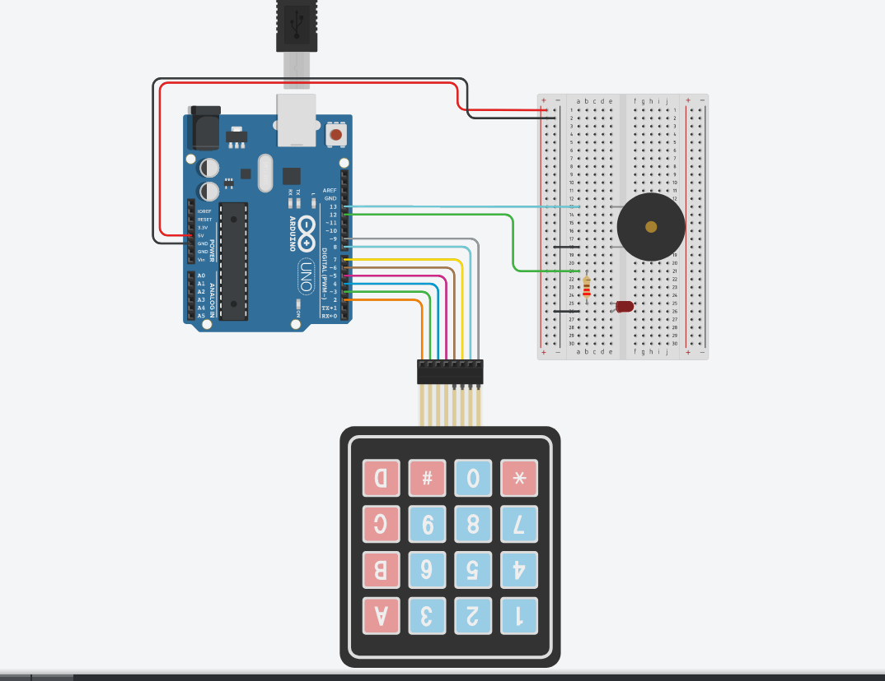

# Дизајнирање

## Архитектура

- Хардвер: Arduino Uno, breadbord, jumper wires, piezo, 4x4 keypad module, LED, 220 ohm resistor
- Софтвер: Arduino IDE

## Технички ресурси

- Proof of concept:

## Тим

За оваа идеја да стане реалност ќе се погрижам јас со помош на сопствените знаења, како и истражувања и видеа од слични проекти пронајдени на Интернет. Во однос на хардверските компоненти, купени се готови, изработени од хардверски инженери и користен е софтвер изработен соодветно од ВС софтверски инженери.